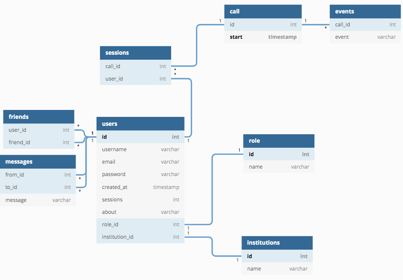

# VedAR Web App
Aplicación web enfocada al sector de la educación que permite realizar llamadas más interactivas con Realidad Aumentada.

## Instrucciones de uso
1. Ejecutar el script:
```
python3 server.py
```
2. Abrir la dirección ```127.0.0.1:5000/home``` o la dirección IP del computador donde está corriendo el servidor ```IP:5000/home``` con el puerto 5000.
3. Crear una cuenta o iniciar sesión.
4. ¡Listo para usar VedAR!

## Tech stack
### Front-end
- HTML5
- CSS3
- Bootstrap
- AOS Scroll Animations

### Back-end
- Python
- OpenCV
- Flask
- Bcrypt
- Jinja2
- SQL (sqlite3)
- Email Validation API by Chema (https://github.com/neo22s/emailvalidator/)

# Demostración

## Login y Registro


### Autenticación y Verificación


## Página de Usuario


### Configuración de Perfil


### Amigos de Usuario


#### Verificación


### Mensajes de usuario


#### Verificación


## Sesiones de video

### Tablero
Seguimiento de color para generar tablero en cámara


### Avatar
Face tracking y reacciones de avatar a partir de gestos


## Base de Datos (SQLite)



